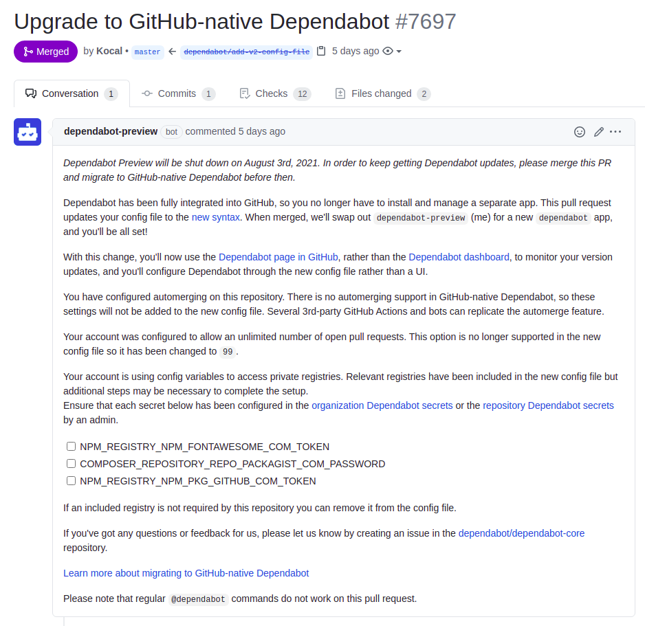
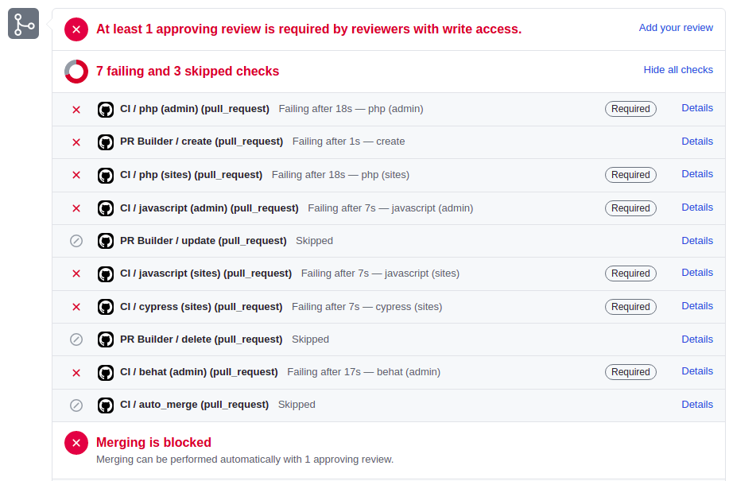
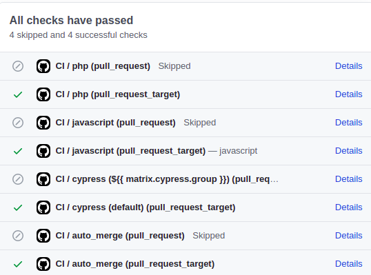
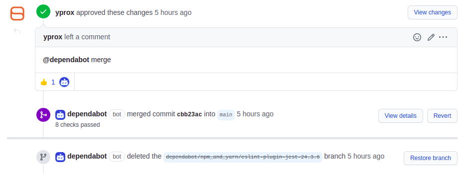
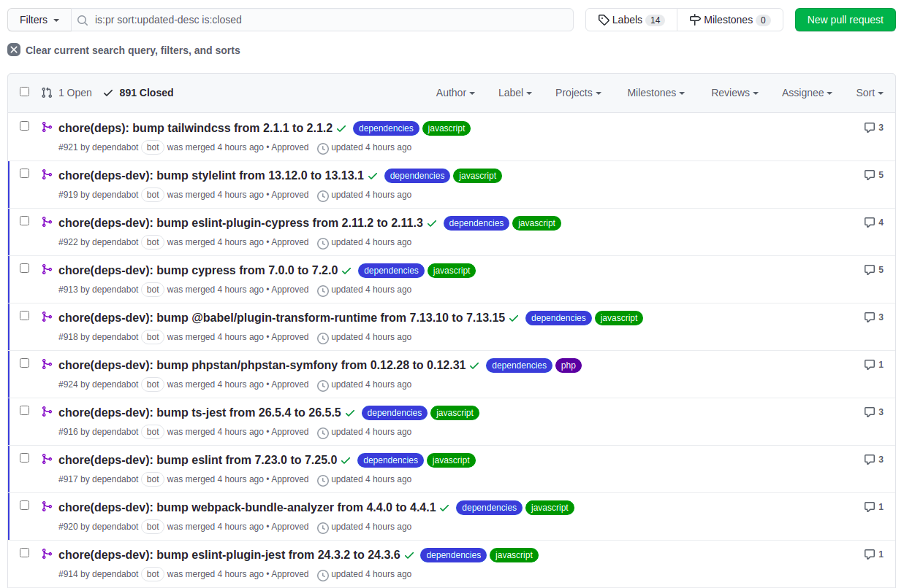

## The end of Dependabot Preview is near

Dependabot Preview ([dependabot.com](https://dependabot.com/)) - which [was acquired by GitHub](https://dependabot.com/blog/hello-github/) on May 23rd, 2021 - will be shut down on August 3rd, 2021
in favor of [the GitHub-native Dependabot](https://docs.github.com/en/code-security/supply-chain-security/keeping-your-dependencies-updated-automatically).

One week ago, we started to see many pull requests from Dependabot across our organization's repositories:


This is very nice, an automated pull request that migrates our [legacy non-native configuration file](https://dependabot.com/docs/config-file/) to the 
[new format `v2`](https://docs.github.com/en/code-security/supply-chain-security/configuration-options-for-dependency-updates). What could go wrong? **This:**
> You have configured automerging on this repository. There is no automerging support in GitHub-native Dependabot, so these settings will not be added to the new config file. Several 3rd-party
> GitHub Actions and bots can replicate the automerge feature.

At first, I was like "Wtf? :fearful:", and of course I'm not the only one to not be happy about this change, see some GitHub issues:
- [Dependabot auto merge not working](https://github.com/dependabot/dependabot-core/issues/1973) 
- [Dependabot should automerge if all *mandatory* pull-request checks are passing](https://github.com/dependabot/dependabot-core/issues/2036) 
- [Support for `automerge` in GitHub Native Dependabot](https://github.com/dependabot/dependabot-core/issues/2268) 
- ["Merge on approval" on GitHub-native Dependabot](https://github.com/dependabot/dependabot-core/issues/2376) 

After reading all of this issues and comments, I understood this change was for security purposes and that's a good thing. 
However, as [I commented](https://github.com/dependabot/dependabot-core/issues/1973#issuecomment-830065746), it was not possible for us at job:
- we have around ~200 public and private repositories,
- we are a very small team (~4 peoples),
- we **cannot** review, approve, and merge all Dependabot pull requests across all of our repositories, we don't have the time, and we have better things and more critical to work on,
- we have a lot of tests in our projects, and we are pretty confident for auto-merging patch and minor updates without the fear of having a non-functional project in production.

Nope, the auto-merge is gone from Dependabot, there is no checkbox `Enable Dependabot auto-merge` or something else to configure.
Instead, you should implement it yourself or use a 3rd party GitHub Action, _which is even promoted by Dependabot_ (???):
> Several 3rd-party GitHub Actions and bots can replicate the automerge feature.

The thing is - even if I'm an open-source contributor and really like open-source - I **can't 100% trust 3rd-party GitHub Actions** which use
an access token with write access for merging (and auto-approving if needed), while I can **100% trust Dependabot** since it's part of GitHub.

## Re-enable auto-merging (with auto-approve)

So, how can we re-enable auto-merging Dependabot pull requests?

The solution I've used has the following features:
- it runs automatically after our CI jobs being successful
- it respects the update type (`minor`, `patch` ...)
- it can auto-approve the pull request if needed
- aaaaaand of course it auto-merge the pull request :tada:

No, I'm not using [Kodiak](https://github.com/chdsbd/kodiak) or [Renovate](https://github.com/renovatebot/renovate). 
To be honest I didn't understand how to perfectly configure Kodiak to fit our needs, I felt that I could break everything with a bad configuration :sweat_smile:.
For Renovate, I was not a big fan of the GitHub App and of the self-hosted integration (which is great to configure `hostRules` with private auth at this level instead of doing it per project).

I'm leaving my job in one week, and I don't want to add new things that required me whole days to understand, and needs to be maintained.
I don't want to leave a poisoned gift for my team. :gift: 

Dependabot **is doing a great job**, so let's keep using it! It's fully integrated to GitHub, it's reactive, it's easily configurable and there is even a dedicated page
[to configure secrets for Dependabot](https://docs.github.com/en/code-security/supply-chain-security/managing-encrypted-secrets-for-dependabot). 
For example, if we need to update our [packagist.com](https://packagist.com/) auth token, we just need to do it only once at one place, and that's fantastic.

So, given a _very basic_ GitHub Action workflow (jokes aside, this is the kind of workflow we use at work with 2 or 3 jobs `php`, `javascript` and `cypress`):
```yaml
name: CI

on:
  pull_request:
    types: [opened, synchronize, reopened, ready_for_review]

env:
  TZ: UTC

  COMPOSER_ALLOW_SUPERUSER: '1' # https://getcomposer.org/doc/03-cli.md#composer-allow-superuser
  COMPOSER_AUTH: '{"http-basic":{"repo.packagist.com":{"username":"token","password":"${{ secrets.PACKAGIST_AUTH_TOKEN }}"}}}'

jobs:
  php:
    runs-on: ubuntu-latest
    steps:
      - uses: actions/checkout@v2

      - uses: ./.github/actions/setup-environment

      - uses: shivammathur/setup-php@v2
        with:
          php-version: ${{ env.PHP_VERSION }}
          coverage: none
          extensions: iconv, intl
          ini-values: date.timezone=${{ env.TZ }}
          tools: symfony

      - uses: actions/setup-node@v2
        with:
          node-version: ${{ env.NODE_VERSION }}

      - uses: actions/cache@v2
        with:
          path: ${{ env.COMPOSER_CACHE_DIR }}
          key: ${{ runner.os }}-composer-${{ hashFiles('**/composer.lock') }}
          restore-keys: ${{ runner.os }}-composer-

      - uses: actions/cache@v2
        with:
          path: ${{ env.YARN_CACHE_DIR }}
          key: ${{ runner.os }}-yarn-${{ hashFiles('**/yarn.lock') }}
          restore-keys: ${{ runner.os }}-yarn-

      # Check dependencies
      - run: symfony composer validate
      - run: symfony security:check

      # Install environment and application
      - run: make setup@integration

      # Prepare tests
      - run: symfony console cache:clear
      - run: APP_ENV=test symfony console doctrine:schema:validate # force APP_ENV=test because only the test database is created
      - run: symfony console api:swagger:export > /dev/null # Check if ApiPlatform is correctly configured

      # Lint Twig, Yaml and XLIFF files 
      - run: symfony console lint:twig templates
      - run: symfony console lint:yaml config --parse-tags
      - run: symfony console lint:xliff translations

      # Static analysis
      - run: symfony php bin/php-cs-fixer.phar fix --verbose --diff --dry-run
      - run: symfony php bin/phpcs
      - run: symfony php bin/phpstan analyse
      - run: APP_ENV=test symfony php bin/phpunit.phar # See https://github.com/symfony/symfony-docs/pull/15228
      - run: symfony php bin/phpspec run

  javascript:
    runs-on: ubuntu-latest
    steps:
      - uses: actions/checkout@v2

      - uses: ./.github/actions/setup-environment

      - uses: shivammathur/setup-php@v2
        with:
          php-version: ${{ env.PHP_VERSION }}
          coverage: none
          extensions: iconv, intl
          ini-values: date.timezone=${{ env.TZ }}
          tools: symfony

      - uses: actions/setup-node@v2
        with:
          node-version: ${{ env.NODE_VERSION }}

      - uses: actions/cache@v2
        with:
          path: ${{ env.COMPOSER_CACHE_DIR }}
          key: ${{ runner.os }}-composer-${{ hashFiles('**/composer.lock') }}
          restore-keys: ${{ runner.os }}-composer-

      - uses: actions/cache@v2
        with:
          path: ${{ env.YARN_CACHE_DIR }}
          key: ${{ runner.os }}-yarn-${{ hashFiles('**/yarn.lock') }}
          restore-keys: ${{ runner.os }}-yarn-

      - run: make setup@integration

      # Check TypeScript types
      - run: yarn tsc --noEmit

      # Lint JS and CSS files
      - run: yarn lint:js --no-fix
      - run: yarn lint:css --no-fix

      # Build for developemnt and production
      - run: yarn dev
      - run: yarn prod

  cypress:
    runs-on: ubuntu-latest
    name: cypress (${{ matrix.cypress.group }})
    strategy:
      fail-fast: false
      matrix:
        cypress:
          - group: default
            spec: 'tests/cypress/**/*'

    steps:
      - uses: actions/checkout@v2

      - uses: ./.github/actions/setup-environment

      - uses: shivammathur/setup-php@v2
        with:
          php-version: ${{ env.PHP_VERSION }}
          coverage: none
          extensions: iconv, intl
          ini-values: date.timezone=${{ env.TZ }}
          tools: symfony

      - uses: actions/setup-node@v2
        with:
          node-version: ${{ env.NODE_VERSION }}

      - uses: actions/cache@v2
        with:
          path: ${{ env.COMPOSER_CACHE_DIR }}
          key: ${{ runner.os }}-composer-${{ hashFiles('**/composer.lock') }}
          restore-keys: ${{ runner.os }}-composer-

      - uses: actions/cache@v2
        with:
          path: ${{ env.YARN_CACHE_DIR }}
          key: ${{ runner.os }}-yarn-${{ hashFiles('**/yarn.lock') }}
          restore-keys: ${{ runner.os }}-yarn-

      - run: make setup@integration

      # Start Symfony server
      - run: APP_ENV=test symfony serve --port 8000 --daemon
      - run: echo "CYPRESS_BASE_URL=https://localhost:8000" >> $GITHUB_ENV

      - name: Run Cypress
        if: ${{ env.IS_DEPENDABOT == 'false' && ! github.event.pull_request.draft }}
        uses: cypress-io/github-action@v2
        with:
          spec: ${{ matrix.cypress.spec }}
          record: true
          parallel: true
          group: ${{ matrix.cypress.group }}
          env:
              CYPRESS_RECORD_KEY: ${{ secrets.CYPRESS_RECORD_KEY }}

      - name: Run Cypress (for Dependabot or when pull request is draft)
        if: ${{ env.IS_DEPENDABOT == 'true' || github.event.pull_request.draft }}
        uses: cypress-io/github-action@v2

  auto_approve:
    runs-on: ubuntu-latest
    needs: [php, javascript, cypress]
    if: ${{ github.actor == 'dependabot[bot]' }}
    steps:
      - uses: hmarr/auto-approve-action@v2.0.0
        with:
          github-token: ${{ secrets.GITHUB_TOKEN }}
```

Here we have 4 jobs `php`, `javascript`, `cypress` and `auto_approve`. The last one is a bit special because it needs all the other jobs to success before running.
When jobs `php`, `javascript` and `cypress` will be successful, the job `auto_approve` will run.

We already used [hmarr/auto-approve-action](https://github.com/hmarr/auto-approve-action) to automatically approve Dependabot pull requests, but it does not support auto-merge.

Instead, we now use [ahmadnassri/action-dependabot-auto-merge](https://github.com/ahmadnassri/action-dependabot-auto-merge) which supports auto-approve **and** auto-merge Dependabot pull requests.
It can be configured through a configuration file [`.github/auto-merge.yml`](https://github.com/ahmadnassri/action-dependabot-auto-merge#configuration-file-syntax) to have a more fine-grained configuration. 
This is how our file looks like:
```yaml
# Documentation: https://github.com/ahmadnassri/action-dependabot-auto-merge#configuration-file-syntax

- match:
      dependency_type: development
      update_type: semver:minor # includes patch updates!

- match:
      dependency_type: production
      update_type: security:minor # includes patch updates!
```

Then we update our workflow to use the action: 
```diff
  auto_approve:
    runs-on: ubuntu-latest
    needs: [php, javascript, cypress]
    if: ${{ github.actor == 'dependabot[bot]' }}
    steps:
-     - uses: hmarr/auto-approve-action@v2.0.0
-       with:
-         github-token: ${{ secrets.GITHUB_TOKEN }}
+     - uses: ahmadnassri/action-dependabot-auto-merge@v2
+       with:
+         github-token: ${{ secrets.ACTION_DEPENDABOT_AUTO_MERGE_TOKEN }}
```

That's it! You've just successfully re-added auto-merging feature to GitHub-native Dependabot, while respecting update types, and without migrating
to another new service.

The new pull requests from Dependabot **will be automatically approved and merged** after all your CI pass!

...

Wait what? It's red, what happens?? :boom: :rotating_light:


## Share your secrets with Dependabot

If your workflows depend on [Action Secrets](https://docs.github.com/en/actions/reference/encrypted-secrets), maybe you already faced this problem.
It's a new thing from GitHub, see blog post [GitHub Actions: Workflows triggered by Dependabot PRs will run with read-only permissions](https://github.blog/changelog/2021-02-19-github-actions-workflows-triggered-by-dependabot-prs-will-run-with-read-only-permissions/)
> Starting March 1st, 2021 workflow runs that are triggered by Dependabot from `push`, `pull_request`, `pull_request_review`, or `pull_request_review_comment` events will be 
> treated as if they were **opened from a repository fork**. 
> This means they will receive a **read-only `GITHUB_TOKEN`** and will **not have access to any secrets available in the repository.** 
> This will cause any workflows that attempt to write to the repository to fail.

And since we use many secrets (`PACKAGIST_AUTH_TOKEN`, `ACTION_DEPENDABOT_AUTO_MERGE_TOKEN`, ...), the workflow fails because it has no access to them.

... Sigh... another _great thing_ from GitHub, but that for security concerns again, so it's fine I guess.
What should we do to make our workflow working again? 

There is already a GitHub issue [Dependabot can't read secrets anymore](https://github.com/dependabot/dependabot-core/issues/3253), perfect!
After several readings, I learned about [`pull_request_target` event](https://docs.github.com/en/actions/reference/events-that-trigger-workflows#pull_request_target) which allows the workflow
to access secrets, nice!

::: danger
This event runs in the context of the base of the pull request, rather than in the merge commit as the `pull_request` event does. 
This prevents executing unsafe workflow code from the head of the pull request that could alter your repository or steal any secrets
you use in your workflow. This event allows you to do things like create workflows that label and comment on pull requests based on
the contents of the event payload.
:::

We need to be careful and **only** allow the Dependabot user for `pull_request_target` event.
How can we achieve this without duplicating our whole workflow?

1. Duplicate the `on.pull_request` to `on.pull_request_target` like this:
```diff
on:
  pull_request:
    types: [opened, synchronize, reopened, ready_for_review]
+ pull_request_target:
+   types: [opened, synchronize, reopened, ready_for_review]
```
2. For each job, check if `it's a pull request not opened by Dependabot` **or** `a pull-request from fork opened by Dependabot` like this:
```diff
jobs:
    php:
        runs-on: ubuntu-latest
+       # If the PR is coming from a fork (pull_request_target), ensure it's opened by "dependabot[bot]".
+       # Otherwise, clone it normally.
+       if: |
+           (github.event_name == 'pull_request_target' && github.actor == 'dependabot[bot]') ||
+           (github.event_name != 'pull_request_target' && github.actor != 'dependabot[bot]')
        steps:
            # ...
```
3. For each job, change the way you checkout the pull request:
```diff
jobs:
    php:
        runs-on: ubuntu-latest
        # If the PR is coming from a fork (pull_request_target), ensure it's opened by "dependabot[bot]".
        # Otherwise, clone it normally.
        if: |
            (github.event_name == 'pull_request_target' && github.actor == 'dependabot[bot]') ||
            (github.event_name != 'pull_request_target' && github.actor != 'dependabot[bot]')
        steps:
-            - uses: actions/checkout@v2
+            - name: Checkout
+             if: ${{ github.event_name != 'pull_request_target' }}
+             uses: actions/checkout@v2
+
+            - name: Checkout PR
+              if: ${{ github.event_name == 'pull_request_target' }}
+              uses: actions/checkout@v2
+              with:
+                ref: ${{ github.event.pull_request.head.sha }}
```

That's it, we updated our workflow file that supports both:
- `pull_request` event, when you open a new pull request from the base repository
- `pull_request_target` event, for Dependabot **only** when it open a new pull request from a fork

After pushing your changes, Dependabot pull requests will now have access to secrets, and your checks should be green :green_heart::



## Conclusion

In this article, we were able to auto-merge Dependabot pull requests again:
- we stayed with Dependabot, no migration to Kodiak, Renovate or anything else
- we added back the auto-approve and auto-merge, thanks to [ahmadnassri/action-dependabot-auto-merge](https://github.com/ahmadnassri/action-dependabot-auto-merge)
- we let Dependabot access our workflow secrets again, by using `on: pull_request_target` **and** limiting the jobs to the Dependabot user only

<figure>
  
  <figcaption><em>Our bot "yprox" approving the pull-request and saying Dependabot to merge</em></figcaption>
</figure>

Those two last days were a bit stressful, thinking of how to bring back auto-approve and auto-merge behaviours, respect the update type, if we needed to change
to another _dependencies manager_ service or not...

But that's over, I was able to get it working some hours ago, and I'm **so happy**!! :smile: 
I wanted to share my problems and solutions to the community, but also to my team to explain them what I've done those last days and what changed with Dependabot.

<figure>
  
  <figcaption><em>List of some last auto-merged GitHub-native Dependabot pull requests </em></figcaption>
</figure>
